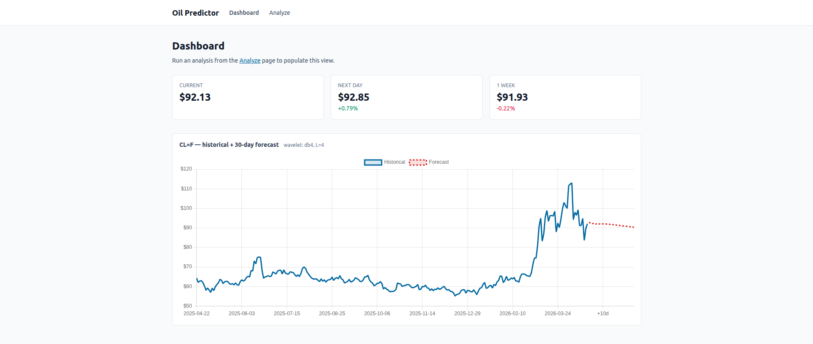

# Oil Price Prediction with Wavelets



웨이블릿 분해와 딥러닝(LSTM 계열)을 결합해 원유 선물(WTI / Brent) 가격을 예측하고, 리스크 분석·트레이딩 시그널까지 제공하는 풀스택 시스템입니다.

- **Backend**: Python · TensorFlow 2.x · FastAPI
- **Frontend**: Vue 3 · Vite · TypeScript · Pinia · Chart.js
- **ML Core**: PyWavelets(DWT) + LSTM / BiLSTM / CNN-LSTM / Attention / Ensemble

## 주요 기능

- **웨이블릿 분해 기반 예측** — 가격 신호를 trend + detail 성분으로 분해하여 주파수 대역별로 서로 다른 LSTM 아키텍처로 학습
- **앙상블 모델** — 게이팅 네트워크로 가중치를 학습하는 advanced ensemble 지원
- **리스크 분석** — 변동성, VaR/CVaR(Historical·Parametric·Cornish-Fisher), 드로다운, 예측 불확실성, 모델 안정성
- **트레이딩 시그널** — BUY/SELL/HOLD · 강도 · 신뢰도 · 포지션 사이징(Kelly·VaR 기반) · 손절/익절
- **REST API** — FastAPI + CORS, Vue SPA와 통신
- **시각화** — Matplotlib 기반 가격/분해/학습/리스크/시그널 대시보드

## 프로젝트 구조

```
oil-price-prediction-wavelets/
├── backend/                       # Python 백엔드 (ML + API)
│   ├── main.py                    # CLI 엔트리 (basic / advanced / comparison)
│   ├── predictor_engine.py        # 전체 파이프라인 오케스트레이터
│   ├── data_processor.py          # yfinance 수집·시퀀스 생성·스케일링
│   ├── wavelet_analyzer.py        # DWT 분해·복원·디노이징
│   ├── model_builder.py           # Keras 모델 팩토리 (LSTM variants)
│   ├── risk_analyzer.py           # RiskAnalyzer + TradingSignalGenerator
│   ├── visualization_tools.py     # Matplotlib 시각화
│   ├── config_example.json        # 컴포넌트별 모델 설정 예시
│   ├── requirements.txt
│   ├── api/                       # FastAPI REST 레이어
│   │   ├── app.py                 #   앱 팩토리 + CORS
│   │   ├── schemas.py             #   Pydantic 모델
│   │   ├── routers/               #   /api/health · /api/predict · /api/wavelets
│   │   └── services/              #   prediction_service
│   └── tests/                     # 스모크 테스트
├── frontend/                      # Vue 3 SPA
│   └── src/
│       ├── main.ts · App.vue
│       ├── router/                #  / → Dashboard, /analyze → Analyze
│       ├── stores/prediction.ts   # Pinia 스토어
│       ├── api/client.ts          # axios + 타입 정의
│       ├── views/                 # AnalyzeView, DashboardView
│       └── components/PriceChart.vue
└── docs/
    ├── architecture.md            # 시스템 아키텍처 문서
    └── uml.md                     # Mermaid UML 다이어그램
```

자세한 구조·데이터 플로우·설계 결정은 [`docs/architecture.md`](docs/architecture.md), 다이어그램은 [`docs/uml.md`](docs/uml.md) 참고.

## 빠른 시작

### Backend (API 서버)

```bash
cd backend
pip install -r requirements.txt
uvicorn api.app:app --reload --port 8000
```

기동 후 헬스체크:
```bash
curl http://localhost:8000/api/health
```

### Frontend (Vue 3)

```bash
cd frontend
npm install
npm run dev   # http://localhost:5173
```

개발용 CORS는 `http://localhost:5173` 기준으로 설정돼 있습니다. API base URL은 `VITE_API_BASE_URL` 환경변수로 재정의 가능 (기본값 `/api`).

### CLI (서버 없이 배치 예측)

```bash
cd backend
python main.py --mode basic --symbol CL=F --days 30          # 기본 30일 예측
python main.py --mode advanced --symbol BZ=F                 # 고급 분석 (Brent)
python main.py --mode comparison                             # 웨이블릿 비교
```

## REST API

| 메서드 | 경로 | 설명 |
|--------|------|------|
| `GET`  | `/api/health`   | TensorFlow 버전, GPU 사용 가능 여부 |
| `GET`  | `/api/wavelets` | 사용 가능한 웨이블릿 목록 (family별) |
| `POST` | `/api/predict`  | 학습 + 예측 실행 (요청당 30~90초 소요, timeout 10분) |

**Request 예시 (`POST /api/predict`)**:
```json
{
  "symbol": "CL=F",
  "days": 30,
  "wavelet": "db4",
  "decomposition_level": 5,
  "sequence_length": 60,
  "epochs": 100
}
```

**Response 요약**:
```json
{
  "symbol": "CL=F",
  "current_price": 75.32,
  "historical_dates": ["2024-04-01", "..."],
  "historical_prices": [72.10, 73.50, "..."],
  "predictions": [75.80, 76.20, "..."],
  "component_predictions": [
    {"name": "trend",    "values": [...]},
    {"name": "detail_1", "values": [...]}
  ],
  "wavelet": "db4",
  "decomposition_level": 5,
  "generated_at": "2026-04-23T10:30:00Z"
}
```

## 프로그래밍 방식 사용

```python
from predictor_engine import PredictionEngine
from risk_analyzer import RiskAnalyzer, TradingSignalGenerator

engine = PredictionEngine(wavelet='db4', decomposition_level=5, sequence_length=60)

results = engine.run_full_pipeline(symbol='CL=F', n_predictions=30, epochs=100)

risk_report = RiskAnalyzer().generate_risk_report(
    prices=results['historical_prices'],
    predictions=results['predictions'],
    component_predictions=results['component_predictions'],
)

signals = TradingSignalGenerator(risk_tolerance='medium').generate_comprehensive_signals(
    current_price=results['current_price'],
    predictions=results['predictions'],
    risk_metrics=risk_report,
    portfolio_value=100_000,
)
```

## 모델 아키텍처

```
원본 가격 ──► [DWT 분해] ──► trend + detail_1..5
                                    │
                  컴포넌트별 독립 스케일러 + 시퀀스 생성
                                    │
                   ┌────────────────┼────────────────┐
                   ▼                ▼                ▼
              LSTM(trend)   BiLSTM(detail_1)   CNN-LSTM(detail_2) ...
                   │                │                │
                   └────── 예측 후 역정규화 ─────────┘
                                    │
                                  Σ 합 ──► 최종 예측
                                    │
                              리스크 분석 · 시그널 생성
```

**지원 모델 (`model_builder.py`)**
- `simple` — 2× LSTM + Dense
- `bidirectional` — 2× BiLSTM + Dense
- `cnn_lstm` — Conv1D + MaxPool + LSTM
- `attention` — Scaled dot-product attention on LSTM
- `ensemble` — LSTM·BiLSTM·CNN-LSTM 평균
- `advanced_ensemble` — 전문가 3개 + gating network (trend에 권장)

**설정 예시 (`backend/config_example.json`)**
```json
{
  "wavelet": "db4",
  "decomposition_level": 5,
  "sequence_length": 60,
  "model_config": {
    "trend":    "ensemble",
    "detail_1": "bidirectional",
    "detail_2": "cnn_lstm",
    "detail_3": "attention",
    "detail_4": "simple",
    "detail_5": "simple"
  }
}
```

## 메트릭

**예측 정확도** — MSE · MAE · RMSE · R² · MAPE
**리스크** — 일간/연간 변동성, 30·60·90일 롤링, Historical/Parametric/Cornish-Fisher VaR, CVaR, 최대/평균/현재 드로다운, 드로다운 지속 기간
**시그널** — 방향(BUY·SELL·HOLD), 강도(STRONG·MODERATE·WEAK·NEUTRAL), 신뢰도(HIGH·MEDIUM·LOW), 1일/1주/1개월 horizon

## 지원 심볼

- `CL=F` — WTI 원유 선물 (기본)
- `BZ=F` — Brent 원유 선물
- `HO=F` — 난방유 선물
- `RB=F` — 휘발유 선물

yfinance API 실패 시 `DataProcessor`가 합성 데이터로 fallback 합니다 (개발·테스트용).

## 문제 해결

**메모리 부족**
```python
# 배치·시퀀스 크기 축소
engine = PredictionEngine(sequence_length=30)
engine.train_component_models(batch_size=16, ...)
```

**GPU 메모리 증가 허용**
```python
import tensorflow as tf
for gpu in tf.config.list_physical_devices('GPU'):
    tf.config.experimental.set_memory_growth(gpu, True)
```

**Mixed Precision (학습 속도 향상)**
```python
from tensorflow.keras import mixed_precision
mixed_precision.set_global_policy('mixed_float16')
```

**CORS 에러** — 프런트 개발 서버 포트가 5173이 아니면 `backend/api/app.py`의 CORS allow-origin 목록 수정.

## 테스트

```bash
cd backend
pytest tests/
```

## 참고 자료

- [TensorFlow 2.x](https://www.tensorflow.org/)
- [PyWavelets](https://pywavelets.readthedocs.io/)
- [yfinance](https://pypi.org/project/yfinance/)
- [FastAPI](https://fastapi.tiangolo.com/)
- [Vue 3](https://vuejs.org/) · [Vite](https://vitejs.dev/) · [Pinia](https://pinia.vuejs.org/)

## 라이선스

MIT — `LICENSE` 참조.
