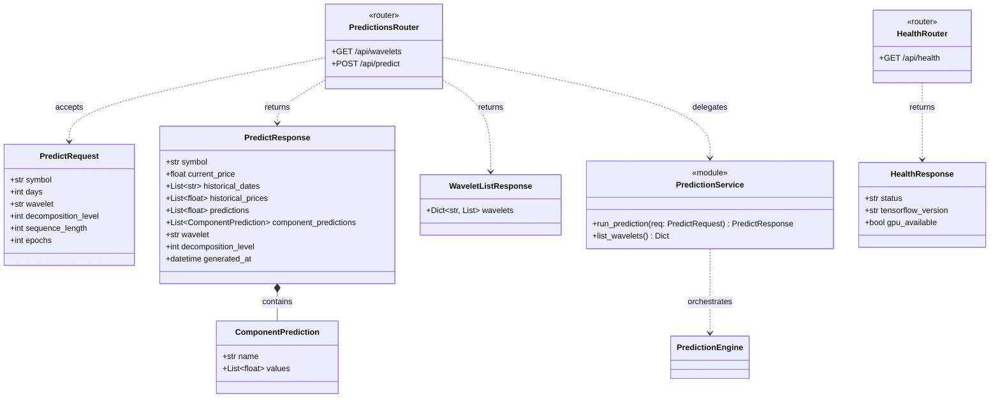
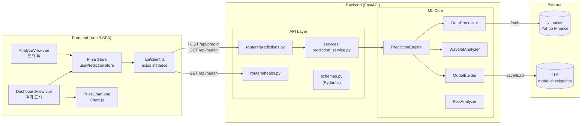
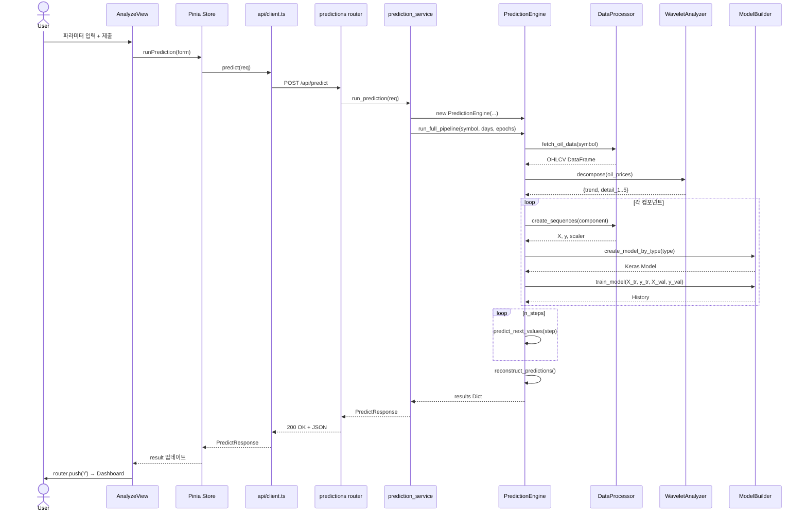
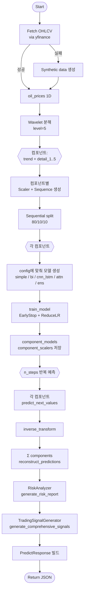
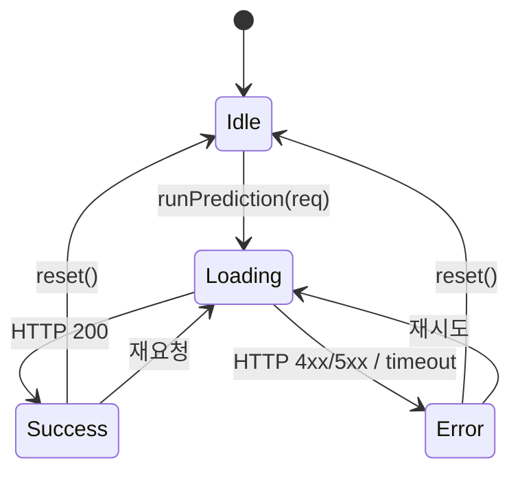
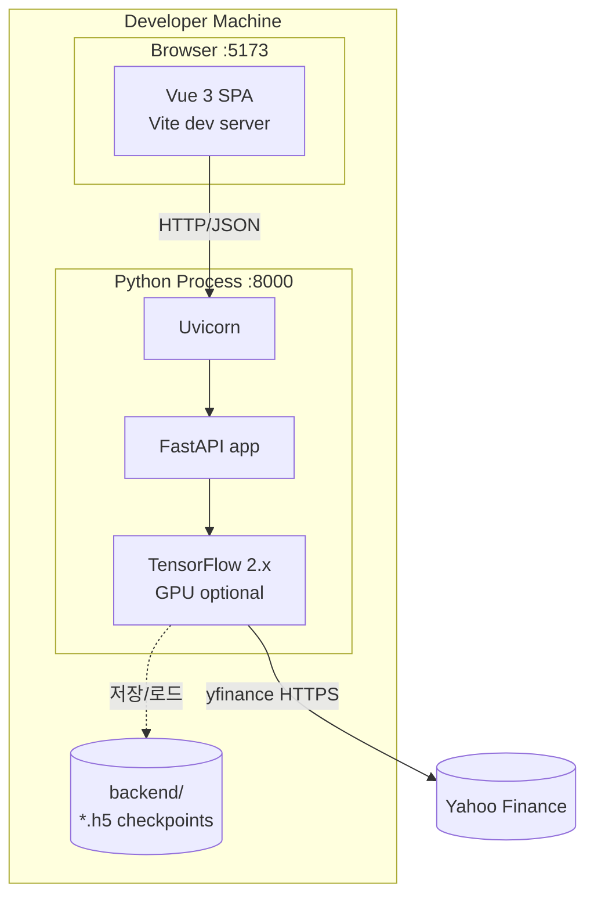
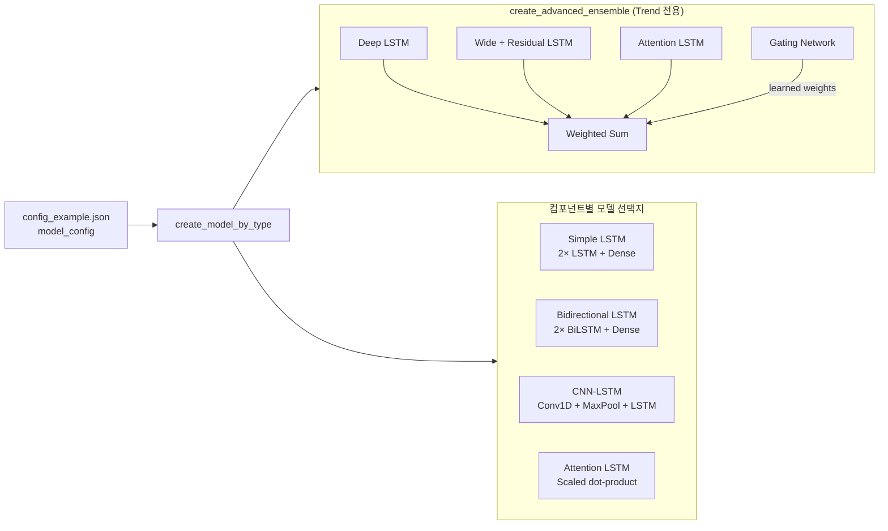

# UML Diagrams

Oil Price Prediction 프로젝트의 UML 다이어그램 모음입니다. 모든 다이어그램은 Mermaid로 작성되어 있어 GitHub, VS Code, IntelliJ 등에서 바로 렌더링됩니다.

## 1. 클래스 다이어그램 — ML 코어

```mermaid
classDiagram
    class DataProcessor {
        -int sequence_length
        -int prediction_horizon
        -MinMaxScaler scaler
        -ndarray raw_data
        -ndarray oil_prices
        -DatetimeIndex dates
        +fetch_oil_data(symbol, start, end) DataFrame
        +create_sequences(data, target_col, scaler) tuple
        +split_data(X, y, train_ratio, val_ratio) tuple
        +inverse_transform(scaled_data) ndarray
        +get_data_statistics() Dict
        +detect_anomalies(threshold) Dict
        +prepare_prediction_input(n_steps_back) ndarray
        -_generate_synthetic_data(n_points) DataFrame
    }

    class WaveletAnalyzer {
        -str wavelet
        -int decomposition_level
        -Dict coefficients
        -Dict components
        -int original_length
        +decompose(signal, plot) Dict
        +reconstruct_signal(components) ndarray
        +validate_reconstruction(signal, tol) Dict
        +analyze_components(signal) Dict
        +denoise_signal(signal, type, mode) ndarray
        +compare_wavelets(signal, wavelet_list) Dict
        +extract_features(signal) Dict
        +plot_decomposition(signal, dates) void
        -_reconstruct_components(signal) Dict
    }

    class ModelBuilder {
        -int sequence_length
        -int prediction_horizon
        -int seed
        -Dict models
        -Dict histories
        +create_simple_lstm(shape, units, dropout, name) Model
        +create_bidirectional_lstm(shape, units, dropout, name) Model
        +create_cnn_lstm(shape, filters, units, dropout, name) Model
        +create_attention_lstm(shape, units, dropout, name) Model
        +create_ensemble_model(shape, name) Model
        +create_advanced_ensemble(shape, name) Model
        +train_model(model, X_tr, y_tr, X_val, y_val, epochs, batch, save_best) History
        +create_model_by_type(type, shape) Model
        +get_model_summary(name) void
    }

    class PredictionEngine {
        -DataProcessor data_processor
        -WaveletAnalyzer wavelet_analyzer
        -ModelBuilder model_builder
        -Dict components
        -Dict component_models
        -Dict component_scalers
        -Dict component_histories
        -bool is_trained
        +load_and_prepare_data(symbol, start, end) DataFrame
        +decompose_signal(plot) Dict
        +train_component_models(config, train_ratio, val_ratio, epochs, batch) Dict
        +predict_next_values(n_steps) Dict
        +reconstruct_predictions(component_preds) ndarray
        +predict(n_steps) Dict
        +run_full_pipeline(symbol, start, end, n_predictions) Dict
        +save_models(path) void
        +load_models(path) void
        +get_model_performance() Dict
    }

    class RiskAnalyzer {
        -float confidence_level
        -float alpha
        +calculate_volatility_metrics(prices) Dict
        +calculate_var_cvar(prices, holding_period) Dict
        +analyze_prediction_risk(preds, current) Dict
        +calculate_drawdown_metrics(prices) Dict
        +generate_confidence_intervals(preds, levels) Dict
        +assess_model_stability(component_preds) Dict
        +generate_risk_report(prices, preds, component_preds) Dict
    }

    class TradingSignalGenerator {
        -str risk_tolerance
        -Dict risk_multipliers
        +generate_directional_signals(current, preds, horizons) Dict
        +calculate_position_sizing(risk_metrics, portfolio) Dict
        +generate_stop_loss_take_profit(current, direction, risk) Dict
        +generate_comprehensive_signals(current, preds, risk, portfolio) Dict
    }

    class PredictionVisualizer {
        -Tuple figsize
        -Dict colors
        +plot_price_history_with_predictions(dates, hist, preds, ci, n_hist, title)
        +plot_training_history(histories, title)
        +plot_decomposition_results(components, dates, title)
        +plot_risk_analysis(report, prices, preds, title)
        +plot_trading_signals_dashboard(signals, current, preds, title)
        +plot_model_comparison(results, title)
    }

    class OilPricePredictionApp {
        -PredictionEngine engine
        -RiskAnalyzer risk_analyzer
        -TradingSignalGenerator signal_generator
        -PredictionVisualizer visualizer
        +run_basic_prediction(symbol, days, plot) Dict
        +run_advanced_analysis(symbol, config) Dict
        +run_comparison_analysis(symbols, wavelets) Dict
        +save_results(path) void
        +load_results(path) void
    }

    PredictionEngine *-- DataProcessor : composes
    PredictionEngine *-- WaveletAnalyzer : composes
    PredictionEngine *-- ModelBuilder : composes
    OilPricePredictionApp *-- PredictionEngine : uses
    OilPricePredictionApp *-- RiskAnalyzer : uses
    OilPricePredictionApp *-- TradingSignalGenerator : uses
    OilPricePredictionApp *-- PredictionVisualizer : uses
    TradingSignalGenerator ..> RiskAnalyzer : depends
```

## 2. 클래스 다이어그램 — API 레이어 (Pydantic 스키마)

## 3. 컴포넌트 다이어그램 (Frontend ↔ Backend)

## 4. 시퀀스 다이어그램 — 예측 요청 전체 흐름

## 5. 활동 다이어그램 — 학습·예측 파이프라인

## 6. 상태 다이어그램 — 프런트엔드 Prediction Store

## 7. 배포 다이어그램

## 8. 모델 계층 구조 (ML 아키텍처)

---

## 참고

- Mermaid 문법: https://mermaid.js.org/
- 본 다이어그램은 현재 코드베이스(`backend/` + `frontend/src/`) 기준이며, 파일 구조가 바뀌면 함께 갱신해야 합니다.
- 아키텍처 세부사항은 [`architecture.md`](./architecture.md) 참조.
